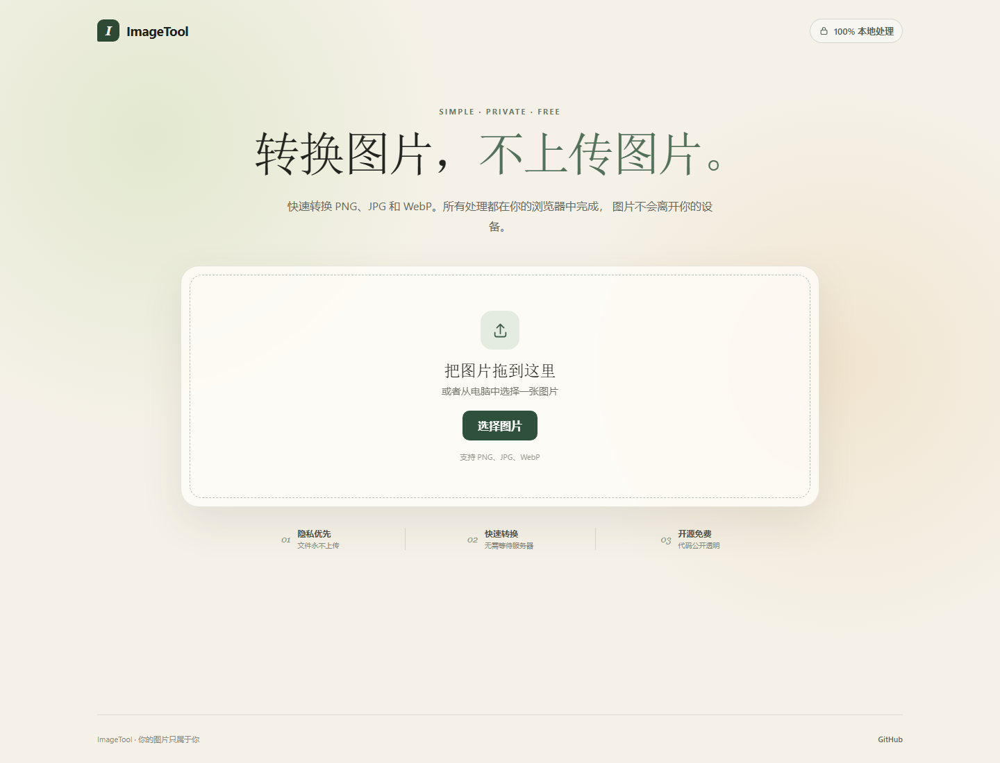

# ImageTool

[](https://github.com/fish34851-hash/ImageTool/actions/workflows/ci.yml)

A simple, privacy-friendly image converter that runs entirely in your browser.

ImageTool converts PNG, JPG, and WebP images locally. Your files are never uploaded to a server.



## Features

- Convert images to PNG, JPG, or WebP
- Convert up to 20 images in one batch
- Resize images proportionally with optional width and height limits
- Rotate images in 90-degree increments before conversion
- Adjust JPG and WebP quality
- Drag and drop or browse for a file
- Preview the image before conversion
- Process every image locally in the browser
- Responsive interface for desktop and mobile
- Zero runtime dependencies
- Remove source metadata by re-encoding image pixels in the browser
- Install the app and use its core interface offline

## Try it locally

The simplest option is to open `index.html` directly in a modern browser.

If you have Node.js installed, you can also run a local development server:

```bash
npm run dev
```

Then open <http://127.0.0.1:5173>.

No `npm install` step is required.

## Install for offline use

Open the [live ImageTool site](https://fish34851-hash.github.io/ImageTool/) in Chrome or Edge. Use the **Install app** control in the browser or the in-page install button when it appears.

After the first successful visit, the application shell can open without reaching the server. Image files and converted results remain temporary local browser data and are not added to the offline cache.

## Check the code

```bash
npm run check
npm test
```

## Privacy

ImageTool uses the browser's Canvas API. Selected images stay on your device and are not sent to any server. The app does not load external fonts, scripts, analytics, or trackers.

Re-encoding through Canvas produces a new image from pixel data, so source EXIF and other file metadata are not copied to the output.

The offline service worker caches only same-origin ImageTool application files. It does not intercept, upload, or store selected images.

## Roadmap

- Image cropping
- More browser-level conversion tests
- Additional interface languages

## Contributing

Contributions are welcome. Read [CONTRIBUTING.md](CONTRIBUTING.md) before opening an issue or pull request.

Used ImageTool for a real task? [Share feedback](https://github.com/fish34851-hash/ImageTool/issues/new/choose) without uploading any private images. Reports from real users guide the roadmap.

Project documentation:

- [Roadmap](ROADMAP.md)
- [Architecture and privacy invariants](docs/ARCHITECTURE.md)
- [Release process](docs/RELEASING.md)
- [Maintainers](MAINTAINERS.md)
- [Security policy](SECURITY.md)

## License

Licensed under the [MIT License](LICENSE).
